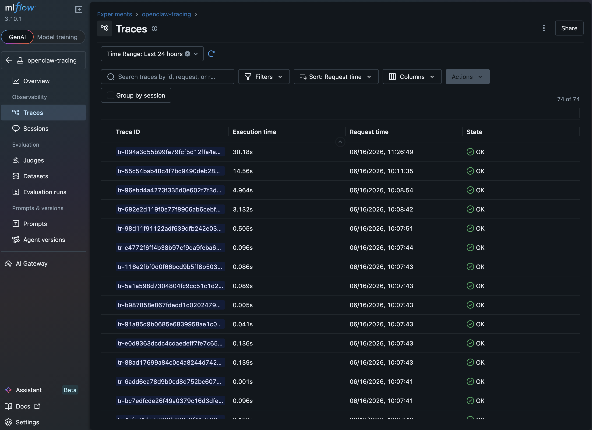
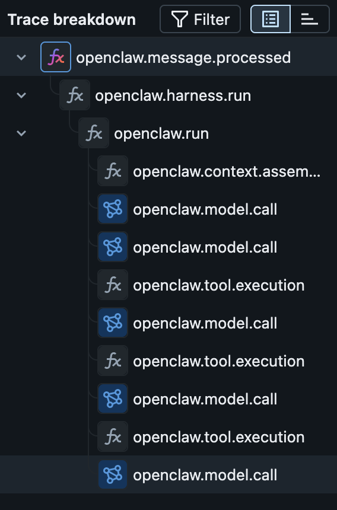
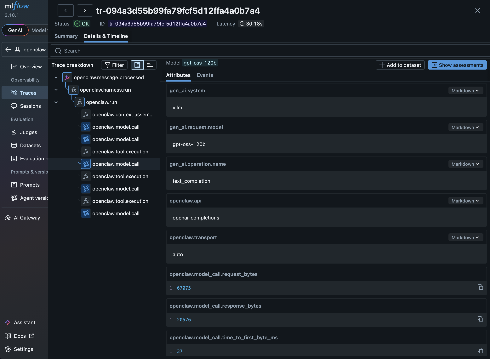
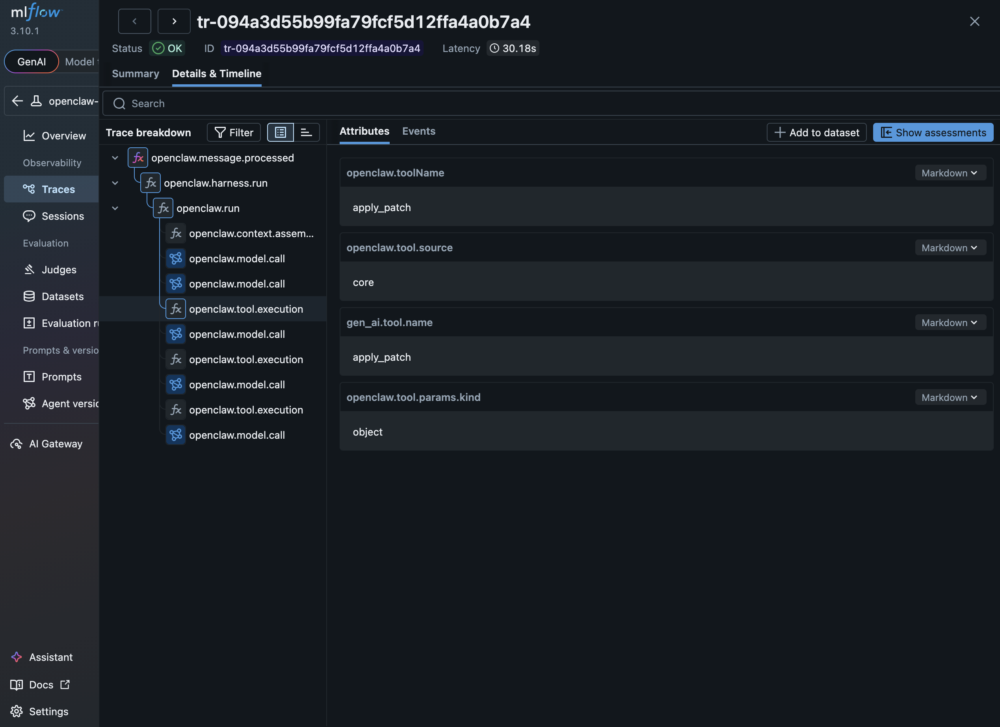

# MLflow Tracing for OpenClaw

> Tested: 2026-06-16 on OpenShift 4.19 (ROSA) with OpenClaw 2026.6.5, vLLM `gpt-oss-120b`

OpenClaw natively emits OpenTelemetry (OTLP) traces via its `diagnostics-otel` plugin — no custom instrumentation, no Python hooks, no stop scripts. This overlay deploys a self-hosted MLflow alongside OpenClaw with an OTel collector sidecar that forwards spans in real time. A multi-turn coding task with 8 model calls and 8 tool executions produced a 19-span trace with full tool names, latencies, request/response sizes, and context window stats — all visible in the MLflow UI.

## Architecture

```
┌─────────────────────────────────────────────────────────────┐
│  OpenClaw Pod                                               │
│                                                             │
│  ┌──────────────┐    OTLP/HTTP     ┌────────────────────┐  │
│  │              │  localhost:4318   │                    │  │
│  │   OpenClaw   │ ───────────────► │   OTel Collector   │  │
│  │   Gateway    │                  │   (sidecar)        │  │
│  │              │                  │                    │  │
│  └──────────────┘                  └─────────┬──────────┘  │
│                                              │              │
└──────────────────────────────────────────────┼──────────────┘
                                               │ otlphttp
                                               │ /v1/traces
                                               ▼
                                    ┌─────────────────────┐
                                    │   MLflow (local)     │
                                    │   port 5000          │
                                    └─────────────────────┘
```

The collector runs as a sidecar in the OpenClaw pod, receiving spans on localhost and forwarding to MLflow's OTLP ingestion endpoint over the cluster network. No auth, no TLS, no external dependencies.

### How this differs from Claude Code

| Concern | Claude Code | OpenClaw |
|---|---|---|
| Instrumentation | Python stop hook (`mlflow autolog claude`) | Native OTLP via `diagnostics-otel` plugin |
| Trace emission | Post-hoc, after session ends | Real-time, as agent runs |
| Dependencies | Python + `mlflow[kubernetes]` in agent image | None — collector is a sidecar |
| OTLP endpoint | Not used (REST API only) | `/v1/traces` — OTLP HTTP ingestion |
| Span granularity | Tool calls, LLM calls, session | Tool calls, LLM calls, harness runs, context assembly |

### Component versions

| Component | Version | Image |
|---|---|---|
| OpenClaw | 2026.6.5 | `ghcr.io/openclaw/openclaw@sha256:037f49...` |
| OTel Collector | 0.120.0 | `ghcr.io/open-telemetry/opentelemetry-collector-releases/opentelemetry-collector-contrib:0.120.0` |
| MLflow | 3.10.1 | `ghcr.io/mlflow/mlflow:v3.10.1` |
| Model backend | vLLM | `gpt-oss-120b` via OpenShift route |

---

## Trace Schema

### Span types

| Span name | What it captures | Key attributes |
|---|---|---|
| `openclaw.message.processed` | Turn-level root span | `channel`, `outcome`, `source` |
| `openclaw.harness.run` | Harness coordination | `items.started`, `items.completed`, `items.active` |
| `openclaw.run` | Agent run lifecycle | `provider`, `model`, `channel`, `trigger`, `outcome` |
| `openclaw.context.assembled` | Context window stats | `token_budget`, `system_prompt_chars`, `message_count`, `history_text_chars` |
| `openclaw.model.call` | LLM inference (span type: LLM) | `time_to_first_byte_ms`, `request_bytes`, `response_bytes`, `gen_ai.request.model` |
| `openclaw.tool.execution` | Tool call | `gen_ai.tool.name`, `openclaw.toolName`, `openclaw.tool.source`, `openclaw.errorCategory` |
| `openclaw.diagnostic.phase` | Startup diagnostics | `phase`, `cpu_user_ms`, `cpu_system_ms` |

### Trace hierarchy

A multi-tool agent turn produces this span tree:

```
openclaw.message.processed           (turn-level root, 14.6s)
└── openclaw.harness.run             (items.completed=13)
    └── openclaw.run                 (trigger=user, outcome=completed)
        ├── openclaw.context.assembled    (token_budget=32768, message_count=4)
        ├── openclaw.model.call           (1.9s, request=68KB, TTFB=49ms)
        ├── openclaw.tool.execution       (read, 4ms)
        ├── openclaw.model.call           (2.0s, request=70KB, TTFB=294ms)
        ├── openclaw.tool.execution       (apply_patch, error)
        ├── openclaw.model.call           (1.4s, request=71KB, TTFB=43ms)
        ├── openclaw.tool.execution       (apply_patch, error)
        ├── ...                           (retry loop)
        ├── openclaw.tool.execution       (apply_patch, 15ms, success)
        └── openclaw.model.call           (1.8s, request=75KB, TTFB=48ms)
```

### Prototype trace data

**Cluster:** ROSA `agentic-mcp` | **Namespace:** `opc-on-ocp` | **Model:** `vllm/gpt-oss-120b`

| Trace | Spans | Duration | Description |
|---|---|---|---|
| `tr-55c54bab...` | 19 | 14.6s | Multi-tool: 8 model calls + 1 read + 7 apply_patch (6 errors, 1 success) |
| `tr-96ebd4a4...` | 5 | 5.0s | Single model call (4.7s LLM, 67KB request, 2.4KB response) |
| `tr-682e2d11...` | 5 | 3.1s | New session: first turn (1.6s LLM, 67KB request, 548B response) |

The `openclaw.model.call` spans capture `time_to_first_byte_ms` (40–294ms), `request_bytes` (67–75KB), and `response_bytes` (548B–2.4KB). Tool execution spans include `gen_ai.tool.name` and `openclaw.errorCategory` on failures.

### MLflow UI

**Traces list** — 74 traces captured in the `openclaw-tracing` experiment:



**Span waterfall** — tree hierarchy for a multi-tool agent turn:



**Model call attributes** — `openclaw.model.call` span detail showing request/response sizes and TTFB:



**Tool execution attributes** — `openclaw.tool.execution` span detail showing tool name and source:



---

## Setup

### Prerequisites

- **OpenShift 4.17+** with namespace-scoped access (`oc login`)
- **Block storage class** (gp3-csi, managed-csi, thin-csi) — not NFS (SQLite requires POSIX file locking)
- **A vLLM-compatible model endpoint** (see [model-compatibility.md](model-compatibility.md))

### Step 1: Copy and configure the overlay

```bash
cp -r overlays/mlflow-tracing overlays/my-tracing
```

Replace every `YOUR-*` placeholder across these files:

| File | What to change |
|---|---|
| `kustomization.yaml` | `YOUR-NAMESPACE` |
| `configmap-patch.yaml` | `YOUR-MODEL-ID`, `YOUR-VLLM-OR-OGX-ENDPOINT`, `YOUR-NAMESPACE`, `YOUR-CLUSTER-DOMAIN` |
| `otel-collector-config.yaml` | `YOUR-NAMESPACE` and `YOUR-EXPERIMENT-ID` (set after Step 3) |

Also set the gateway token in `manifests/01-secret.yaml` — the default is `CHANGE-ME`.

See [raw-deployment.md](raw-deployment.md) for how to find your model ID.

### Step 2: Deploy

```bash
oc new-project YOUR-NAMESPACE   # or use existing namespace

oc apply -k overlays/my-tracing
```

Wait for both pods:

```bash
oc get pods -w
```

Expected: `mlflow-local` at `1/1 Running`, `openclaw` at `2/2 Running` (gateway + otel-collector sidecar).

### Step 3: Create an MLflow experiment

```bash
oc exec deploy/mlflow-local -- \
  env MLFLOW_TRACKING_URI=http://localhost:5000 \
  mlflow experiments create -n openclaw-tracing
```

Note the `experiment_id` from the output (e.g., `Created experiment 'openclaw-tracing' with id 1`). Update `YOUR-EXPERIMENT-ID` in your overlay's `otel-collector-config.yaml`, then re-apply:

```bash
oc apply -k overlays/my-tracing
oc delete pod -l app=openclaw   # restart to pick up new config
```

### Step 4: Set API key (if your model endpoint requires one)

If your endpoint doesn't require an API key (e.g., `apiKey: "not-needed"` in the ConfigMap), skip this step.

```bash
echo "your-api-key" | oc exec -i deploy/openclaw -c gateway -- \
  openclaw models auth paste-api-key --provider vllm
```

> **Important:** `paste-api-key` triggers an in-process restart that breaks the OTel TracerProvider. You **must** do a full pod restart afterward — see [paste-api-key breaks OTel tracing](#paste-api-key-breaks-otel-tracing-in-process-restart) for details.

```bash
oc delete pod -l app=openclaw
oc wait --for=condition=ready pod -l app=openclaw --timeout=120s
```

The API key persists across pod restarts (stored in SQLite on the PVC), so you only need to do this once.

### Step 5: Connect

Port-forward both OpenClaw and MLflow:

```bash
oc port-forward deploy/openclaw 18789:18789 &
oc port-forward deploy/mlflow-local 5001:5000 &
```

- **OpenClaw Control UI:** <http://localhost:18789> — paste the gateway token from `01-secret.yaml` when prompted
- **MLflow UI:** <http://localhost:5001> — navigate to the `openclaw-tracing` experiment to view traces

> Port-forward is required for the Control UI. The OpenShift Route works for HTTP requests but WebSocket connections flap through HAProxy's reverse proxy.

---

## Known Issues

### paste-api-key breaks OTel tracing (in-process restart)

**Symptom:** Startup diagnostic spans (`openclaw.diagnostic.phase`) export to MLflow, but runtime spans (`openclaw.model.call`, `openclaw.tool.execution`) never appear — even though the model responds fine and session trajectory files grow.

**Root cause:** `paste-api-key` writes to `~/.openclaw/openclaw.json`, which triggers the gateway's config file watcher. The watcher detects changes in the `auth` and `meta` fields, determines a restart is required, and sends `SIGUSR1` to itself. The gateway does an in-process restart (keeping PID 1 alive for container health), but the `diagnostics-otel` plugin's `TracerProvider` / `BatchSpanProcessor` from the first initialization is left in a broken state. The second startup loads the plugin in 0.3s (vs 3.5s on first boot) and emits zero spans — not even startup diagnostics.

**Fix:** Always do a full pod restart (`oc delete pod`) after `paste-api-key`. The API key persists in SQLite on the PVC, and the ConfigMap includes `auth.profiles`, so the gateway starts fully configured on the next boot with no config mutation needed.

### WebSocket connections flap through the Route

The OpenShift Route terminates TLS at HAProxy, which disrupts the persistent WebSocket connections used by the Control UI. Symptoms: repeated connect/disconnect cycles (code 1006), prompts never reach the gateway.

**Fix:** Use `oc port-forward` instead of the Route for the Control UI.

---

## RHOAI Shared MLflow (Appendix)

The self-hosted MLflow path above is the recommended approach. If you need to send traces to the RHOAI-managed shared MLflow instance, these additional issues apply:

### SA token audience mismatch (403)

The default pod-mounted SA token has a JWT audience scoped to the Kubernetes API server. MLflow's OTLP endpoint rejects it with 403. Tokens generated via `oc create token` work, but are short-lived.

**Needs upstream:** The OTLP ingestion endpoint needs to accept projected SA tokens with a documented audience.

### TLS certificate signed by unknown authority

The OTel collector rejects the MLflow service's TLS certificate because the cluster CA doesn't cover it.

**Workaround:** `insecure_skip_verify: true` in the OTel collector config.

**Proper fix:** Mount the OpenShift service CA via a ConfigMap with `service.beta.openshift.io/inject-cabundle=true`.

### REST API doesn't expose span-level detail

The `/api/2.0/mlflow/traces` endpoint returns trace metadata but no span data on the RHOAI version. Span details are only viewable through the MLflow UI via the Data Science dashboard's OAuth flow.

---

## Improvement Opportunities

1. **Upstream OpenClaw: expose token usage in OTLP spans.** `openclaw.model.call` captures request/response byte sizes but not discrete token counts. Adding `llm.usage.input_tokens` / `llm.usage.output_tokens` would align with [OTel Semantic Conventions for GenAI](https://opentelemetry.io/docs/specs/semconv/gen-ai/).

2. **Upstream OpenClaw: add session ID as a span attribute.** Multi-turn conversations produce separate traces per turn. A shared session ID would let MLflow correlate turns into a conversation.

3. **Upstream OpenClaw: fix OTel TracerProvider surviving in-process restart.** The `diagnostics-otel` plugin should properly shut down and re-initialize its `TracerProvider` / `BatchSpanProcessor` on SIGUSR1 restart.

4. **This overlay: make auth conditional on endpoint type.** The `auth.profiles` section is only needed for endpoints that require API keys. For keyless endpoints, it could be omitted.

---

## References

| Resource | URL |
|---|---|
| OpenClaw OTel Documentation | <https://docs.openclaw.ai/gateway/opentelemetry> |
| OpenClaw Deployment Guide | [raw-deployment.md](raw-deployment.md) |
| OTel Collector Contrib | <https://github.com/open-telemetry/opentelemetry-collector-contrib> |
| MLflow OTLP Tracing | <https://mlflow.org/docs/latest/tracing/index.html> |
| Claude Code MLflow Tracing | [tracing.md](../../../../tracing.md) |
